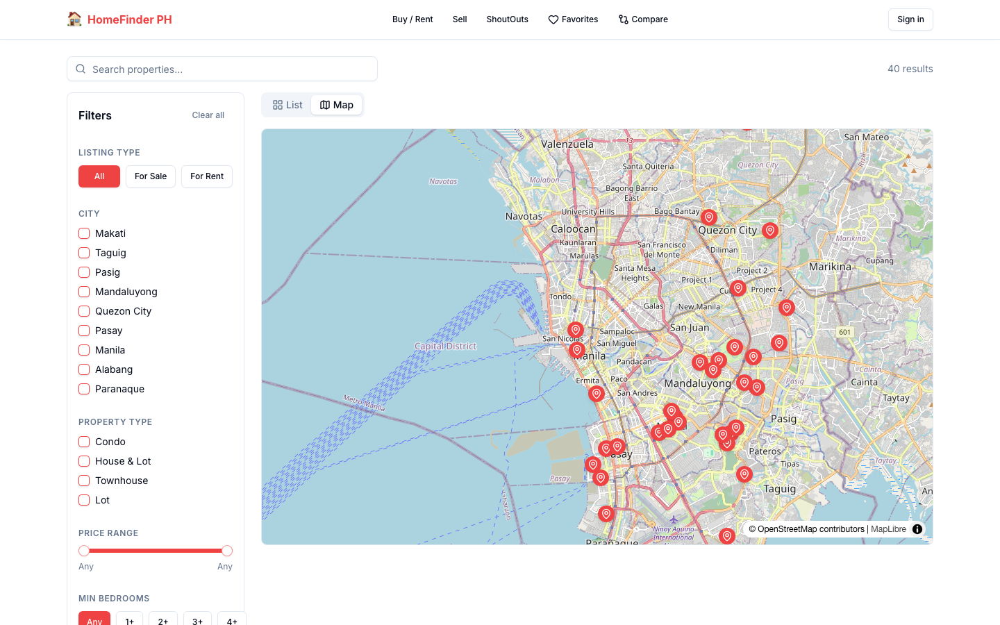

# HomeFinder PH

Property search demo for Metro Manila listings, built on Next.js 16 App Router. Portfolio project with seed data.

**Live:** https://homefinder.kevinciang.com

## Screenshots


Home page with the hero search and featured properties.


Listings page with the Map tab open, showing pins for all 40 seed properties.


Property detail page with gallery and specs.

## Features

- Property search: debounced full-text search across 40 Metro Manila listings
- Interactive map: MapLibre GL JS with OpenStreetMap tiles, click-to-preview pins
- Filters: city, type, status, price range, bedrooms, developer
- Favorites: stored in localStorage
- Compare: side-by-side comparison of up to 3 properties
- ShoutOuts: buyers post wish lists on a community board, using local and API data
- Seller dashboard: list a property, instant valuation estimate, analytics charts
- Price trend charts: 12-month price history per property (Recharts)
- Demo auth: email-only login kept in a Zustand store persisted to localStorage
- Responsive layout: bottom nav, filter sheets, swipeable gallery

### Next.js specifics

- App Router with route handlers under `src/app/api/` that serve the seed data in `src/data/`.
- Server components: the home page (`/`) reads seed data on the server to pick the featured listings. The property detail page (`/properties/[id]`) is an async server component that awaits `params` and uses `generateStaticParams` to prerender all 40 listings at build time.
- All other pages are statically prerendered at build time, and their interactive parts are client components that use TanStack Query and the route handlers for data. No page is rendered per request. Only the route handlers run on demand.
- `output: "standalone"` in `next.config.ts` and a `Dockerfile` that serves on port 8080.
- A GitHub Actions workflow that builds the image and deploys it to Cloud Run.

## Tech Stack

| Layer | Technology |
|---|---|
| Framework | Next.js 16 (App Router) |
| UI | React 19 + TypeScript (strict) |
| Styling | Tailwind CSS v3 + shadcn/ui |
| Server State | TanStack Query v5 |
| Client State | Zustand v5 |
| Maps | MapLibre GL JS + react-map-gl |
| Charts | Recharts |
| Forms | react-hook-form + zod |
| Testing | Vitest + @testing-library/react |
| CI/CD | GitHub Actions |
| Container | Docker, Google Cloud Run + Artifact Registry |

## Run Locally

```bash
pnpm install
pnpm dev
```

Open http://localhost:3000.

To regenerate the screenshots, run `pnpm build && pnpm start`, then `npx playwright install chromium` and `node scripts/screenshots.mjs`.

## Architecture

```
Browser
  ├── TanStack Query ──► Next.js Route Handlers ──► Seed Data (src/data/)
  ├── Zustand Stores ──► localStorage (persist)
  └── MapLibre GL ──► OpenStreetMap Raster Tiles (no API key)
```

## Deploy

[`.github/workflows/deploy.yml`](.github/workflows/deploy.yml) runs lint, typecheck, tests and build on every push to `main`. It then builds the Docker image, pushes it to Artifact Registry in `asia-southeast1`, and deploys it to Cloud Run as the `homefinder-ph` service. Authentication uses Workload Identity Federation.

Required GitHub secrets:

| Secret | Description |
|---|---|
| `GCP_PROJECT_ID` | GCP project ID |
| `GCP_SERVICE_ACCOUNT` | Service account email |
| `GCP_WORKLOAD_IDENTITY_PROVIDER` | Workload Identity Provider resource name |

The live site at homefinder.kevinciang.com is currently served by Vercel, not Cloud Run.

## What this demo does not do

- **Mock backend:** No real database. All property data is in `src/data/`. Submitted listings are not persisted server-side.
- **No real authentication:** Login is email-only, no password, no JWT.
- **Static pricing:** Valuation estimates use a deterministic formula, not real market data.
- **No real images:** Uses Unsplash URLs.

## License

MIT

## Origin

Built as a portfolio piece for a Frontend Developer application at Ohmyhome Property Inc.
